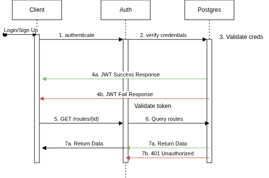

# FastAPI Routes API

A REST API for managing geographic routes. Users register, authenticate via JWT, and create or retrieve routes stored with lat/lon coordinates and a geohash.

## System Design Features




### JWT
- This uses JSON Web Tokens (JWT) to authenticate user requests
- The tokens are valid for 30 days which obviously too long for production but works well for a project piece

### Rate Limiting
- `slowapi`'s built-in rate limiting is a great fit for FastAPI
- 5 requests a minute was chosen for ease of testing

### Geohashing
- Geohash-based proximity search over 100k generated routes centred on Canmore.
- `GET /routes/haversine/{radius}` is the control: the same question answered exactly, by computing great-circle distance for every row in SQL with no index able to help. Deliberately plain — no auth, no pagination, no cache — so benchmarking against it measures the search technique rather than the surrounding machinery.
- **The geohash search is 3.6x faster than exact haversine, and wrong most of the time** (see [Benchmarks](#benchmarks)). This README long claimed "~4x faster than brute force haversine" with no haversine code in the repo to support it. The speed claim turns out to be about right — but only after adding the `ix_routes_geohash` index it silently depended on, and it says nothing about the answers being correct.
- The correctness problem is the interesting one. `calculate_geohash` picks a prefix length whose cell is about the size of the search radius, then returns everything in *that one cell*. But the query circle is centred on the origin while the cell is fixed by the grid — an origin near a cell edge has most of its circle in neighbouring cells that are never searched. Recall at a 10km radius is **5.3%**. The standard fix is to search the cell plus its 8 neighbours and then filter by true distance, which makes the geohash a candidate-set prefilter rather than the answer.
- Prefix matching only uses an index with the right opclass — `Routes.__table_args__` declares `ix_routes_geohash` with `varchar_pattern_ops`, since the DB collation is `en_US.utf8` and a default btree can't serve `LIKE 'prefix%'` under it. Run [scripts/add_geohash_index.py](scripts/add_geohash_index.py) against a DB seeded before the index existed, same as the bbox one.

### Bounding Box Search
- `GET /routes/bbox?min_lat=&min_lon=&max_lat=&max_lon=` returns routes inside a lat/lon box — the shape a map frontend actually asks for, since a viewport is a rectangle, not a radius.
- Public read (no token, no rate limit) so a React map can pan freely. Results are capped at `BBOX_LIMIT` (500) rows, but the response still carries the true `total_count` plus a `capped` flag so the client can tell "500 routes" from "500 shown of 12,000".
- Registered *before* `GET /routes/{route_id}` — FastAPI matches routes in declaration order, so `bbox` would otherwise be parsed as a `route_id` and 422.
- Backed by a composite `(lat, lon)` index (`ix_routes_lat_lon` in [app/db/models.py](app/db/models.py)). `create_all()` won't add an index to an already-existing table, so run [scripts/add_bbox_index.py](scripts/add_bbox_index.py) against a DB seeded before the index existed.

### Pagination
`GET /routes/radius/{radius}` accepts four mutually exclusive pagination styles (see `pagination_params` in [app/schemas/routes.py](app/schemas/routes.py)), tried in this order:

| Style | Params | Notes |
| --- | --- | --- |
| Page-based | `page`, `pageSize` | Computes an offset internally; the familiar "page 3" UI |
| Keyset | `since_id` | `WHERE id > since_id` — no offset scan, stable under inserts |
| Cursor | `cursor` | Same as keyset but the id is base64-encoded and opaque; the response returns the next `cursor` |
| Offset | `offset`, `limit` | Default fallback (`limit=100`) |

`GET /routes/route-pag/{route_id}` is a separate endpoint using `fastapi-pagination`'s native `Page[RouteOut]` / `paginate()` for comparison against the hand-rolled versions above.

### Benchmarks

Results live in [scripts/benchmark/](scripts/benchmark/) as CSVs with a `label` column, appended to on each run.

Pagination ([radius.py](scripts/benchmark/radius.py), 1000 requests each):

| Label | mean ms | p95 ms |
| --- | --- | --- |
| vanilla (no pagination) | 17.0 | 24.1 |
| offset | 9.6 | 15.8 |
| page | 5.8 | 8.5 |
| keyset | 7.7 | 12.7 |
| cursor | 10.8 | 14.7 |

Bounding box ([bbox.py](scripts/benchmark/bbox/bbox.py), 1000 requests mixing 1km and 70km boxes):

| Label | mean ms | p50 ms | p95 ms |
| --- | --- | --- | --- |
| no_index | 20.9 | 19.8 | 27.1 |
| with_index | 13.0 | 6.5 | 22.3 |

The `(lat, lon)` index roughly halves the median. p95 barely moves because the large "zoomed out" boxes are limit-bound, not scan-bound — the index can't help when you're returning 500 rows either way.

Haversine control ([haversine.py](scripts/benchmark/haversine/haversine.py)). This one took three attempts to measure honestly, and the wrong turns are worth more than the final table.

**Attempt 1 — HTTP, 100 rows per request.** Haversine 8.0ms mean, geohash 11.2ms: the exact search apparently beating the optimised one. It wasn't. Both endpoints `ORDER BY id LIMIT 100`, so Postgres walks the primary key index and stops at the 100th match, never evaluating the predicate over the table:

| Query | rows matching | plan | execution |
| --- | --- | --- | --- |
| haversine 50km | ~100,000 | PK index scan, early exit | 0.11 ms |
| haversine 10km | ~3,900 | PK index scan, early exit | 1.51 ms |
| geohash `c3j%` (50km) | ~54,000 | PK index scan, early exit | 0.15 ms |
| geohash `c3jfx%` (10km) | 178 | **sequential scan** | 11–16 ms |

Cost tracked *selectivity*, not technique. The brute force never got brute-forced.

**Attempt 2 — HTTP, 10,000 rows per request.** Past the early exit, so the query genuinely runs. But now a request returning 10k rows is 1.5MB of JSON, and at limit=10,000 the round trip is 160ms of which the query is 6ms. **96% of the measurement is serialization**, which is why adding the geohash index below moved the mean by 1.5% despite making the query 75x faster:

| Label | mean ms | p50 ms | p95 ms |
| --- | --- | --- | --- |
| haversine | 190.1 | 183.4 | 288.6 |
| geohash_no_index | 143.3 | 144.6 | 274.3 |
| geohash_indexed | 141.1 | 136.4 | 279.2 |

**Attempt 3 — `--sql`, `COUNT(*)` straight against Postgres.** No rows to serialize and no early exit, so the predicate runs over the table exactly as the technique demands. 200 queries per label:

| Label | mean ms | p50 ms | p95 ms |
| --- | --- | --- | --- |
| haversine_sql | 17.7 | 16.0 | 27.3 |
| geohash_sql_no_index | 15.5 | 14.6 | 22.1 |
| **geohash_sql_indexed** | **4.9** | **2.3** | **14.9** |

**The geohash search is 3.6x faster than exact haversine — but only once the `geohash` column is indexed.** Without the index both techniques are sequential scans of 100k rows and the only difference is trig arithmetic versus a string compare, worth about 12%. That is why this README's original "~4x faster" claim didn't reproduce: the index it depends on had never been created. It exists now (`ix_routes_geohash`), and the measured 3.6x is close to what the old claim asserted.

The index needs `varchar_pattern_ops`. The database collation is `en_US.utf8`, under which a default btree **cannot** serve `LIKE 'c3jfx%'` — Postgres seq-scans instead. With the right opclass that query goes from a 10.4ms sequential scan to a 0.14ms index-only scan.

Accuracy is the other half, and the more damning half — recall of the geohash search against the haversine truth set, both uncapped, over 50 origins:

| Radius | recall | false positives |
| --- | --- | --- |
| 10km | 4.8% | 0.0% |
| 25km | 25.1% | 0.3% |
| 50km | 65.7% | 19.0% |
| **overall** | **52.2%** | **17.1%** |

At 10km the geohash search misses 95% of the routes genuinely within the radius. It is not a faster way to get the right answer; it is a fast way to get a different one, and indexing it only makes the wrong answer arrive sooner. See the Geohashing section for the cause and the fix.

The through-line: three benchmarks of the same two queries gave "haversine wins", "no difference", and "geohash wins 3.6x". Only the third measured the thing named on the tin.

Redis cache ([cache.py](scripts/benchmark/cache/cache.py), 1000 requests, 95% reads over a 200-search pool at 10/25/50km):

| Label | mean ms | p50 ms | p95 ms | p99 ms |
| --- | --- | --- | --- | --- |
| no_cache | 12.5 | 7.7 | 28.4 | 38.0 |
| with_cache | 5.8 | 4.6 | 10.9 | 27.3 |

Mean more than halves and p95 drops 62%. The tail is where it shows most: p95 is dominated by the 50km searches, which resolve to a 3-character prefix and scan essentially the whole seeded dataset — exactly the queries a cache should be absorbing. p99 improves least, because that's the 5% writes, which the cache makes marginally *slower* (they now do invalidation work on top of the insert).

For comparison, the same benchmark against `GET /routes/{id}` gave 4.9 → 4.0ms mean. Picking the right endpoint mattered more than anything in the cache implementation.

Two things the benchmark does deliberately:

- **Bounded search pool.** Random origins would miss every time and report the cache as worthless; a real map client re-issues overlapping searches. The pool is validated at startup so empty cells (which 404) don't land in the error count.
- **Writes stay in the mix** at 5%, so the numbers include invalidation churn rather than measuring a frozen dataset. Note that `keyspace_misses` from `redis-cli INFO` overstates the read miss rate here — each write probes 11 prefix index sets, most of which don't exist.

Both runs need `RATE_LIMIT_ENABLED=false`, otherwise 5/minute means you're benchmarking 429s:

```bash
CACHE_ENABLED=false RATE_LIMIT_ENABLED=false docker compose up -d api
uv run python scripts/benchmark/cache/cache.py --label no_cache

CACHE_ENABLED=true RATE_LIMIT_ENABLED=false docker compose up -d api
docker compose exec redis redis-cli FLUSHALL
uv run python scripts/benchmark/cache/cache.py --label with_cache
```

Caveat learned the hard way: rebuild the Docker image before benchmarking, or you'll benchmark the old code and record wildly inflated latency.

## File Structure
```
app/
  api/
    routes/
      auth.py       # register + token endpoints
      routes.py     # CRUD, bbox, radius + pagination endpoints
  schemas/
    routes.py       # request/response models + pagination params
  core/
    config.py       # pydantic-settings config from .env
    logging.py      # logging dictConfig setup
    security.py     # JWT encrypt/decrypt, password hashing
  db/
    models.py
    session.py
  main.py           # app factory, lifespan, middleware
scripts/
  seed.py           # generate 100k routes around Canmore
  add_bbox_index.py # one-off (lat, lon) index creation
  add_geohash_index.py # one-off geohash prefix index (varchar_pattern_ops)
  benchmark/        # latency + accuracy benchmarks and results CSVs
    haversine/      # exact-distance control vs the geohash search
```

## Running

```bash
# Start Postgres
docker compose up -d

# Run API (hot reload)
uv run uvicorn app.main:app --reload
```

Connect to the DB directly:
```bash
docker exec -it fastapi-hw-db-1 psql -U myuser -d mydatabase
```

## Logging

Logging is configured in `app/core/logging.py` using Python's `logging.dictConfig` and initialised via FastAPI's `lifespan` hook.

**FastAPI-specific patterns used:**

- **`lifespan` for setup/teardown** — logging is configured in the `lifespan` async context manager rather than at module import time, so it runs after uvicorn's own loggers are initialised. This avoids a race where `dictConfig` resets uvicorn's handlers.

- **`disable_existing_loggers: False`** — the dictConfig keeps uvicorn's built-in `uvicorn` and `uvicorn.access` loggers intact. Overriding these breaks uvicorn's startup banner and access log format.

- **`logging.getLogger(__name__)` per module** — each router file gets its own logger (`app.api.routes.routes`, `app.api.routes.auth`) so log output is traceable to its source without extra fields.


## Docker

Run the full stack (API + Postgres) with Docker Compose:

```bash
docker compose up -d --build
```

This builds the API image from the [Dockerfile](Dockerfile), starts Postgres, and waits for its healthcheck before starting the API. The app is then available at `http://localhost:8000`.

Requires a `.env` file (see [.template.env](.template.env)) with at least:

```
POSTGRES_USER=
POSTGRES_PASSWORD=
POSTGRES_DB=
POSTGRES_PORT=
POSTGRES_HOST=
JWT_SECRET=
```

Useful commands:

```bash
docker compose logs -f api      # tail API logs
docker compose down             # stop containers
docker compose down -v          # stop and wipe the Postgres volume
```

## Kubernetes (minikube)

[resources.yml](resources.yml) holds the Kubernetes manifests, generated from `docker-compose.yml` via `kompose convert -f docker-compose.yml -o resources.yml` — re-run that if the compose file changes.

```bash
minikube start

# Build the image into minikube's own Docker daemon so the cluster can see it
eval $(minikube docker-env)
docker build -t fastapi-hw-api:latest .

kubectl apply -f resources.yml

kubectl get pods
kubectl get svc

minikube service api --url
```

To run the API image standalone against an existing Postgres instance:

```bash
docker build -t fast-api .
docker run --env-file .env -p 8000:8000 fast-api
```


## OpenTelemetry

Traces, metrics, and logs are exported over OTLP to a local [OpenTelemetry Collector](otel/collector.yml), which prints them to its own console.

The `api` service in [docker-compose.yml](docker-compose.yml) runs the app wrapped in `opentelemetry-instrument` (see [Dockerfile](Dockerfile)) and points `OTEL_EXPORTER_OTLP_ENDPOINT` at the `otel-collector` service. Start everything with `docker compose up -d --build`, then tail the collector to see telemetry arrive:

```bash
docker compose logs -f otel-collector
```

Notes:
- The collector's `debug` exporter (`otel/collector.yml`) just dumps detailed output to stdout — fine for confirming traces/logs are flowing, but logs aren't persisted anywhere queryable (traces are, via Jaeger below).
- App logs only reach the collector because `app/core/logging.py`'s `"app"` logger has `propagate: True`, letting records bubble up to the root logger where the OTel logging auto-instrumentation attaches its OTLP export handler.

### Trace viewer (Jaeger)

The collector also exports traces via a second OTLP exporter (`otlp/jaeger` in `otel/collector.yml`) aimed at Jaeger's own native OTLP receiver.

- Jaeger UI: http://localhost:16686 — pick the `fastapi-hw` service to browse spans.

Jaeger's all-in-one image stores traces in memory only, so they're lost on container restart — fine for local dev, not a persistent trace store.

### Metrics dashboard (Prometheus + Grafana)

The collector also exports metrics via a `prometheus` exporter (`otel/collector.yml`, port `8889`), which Prometheus scrapes every 5s (`otel/prometheus.yml`). Grafana comes preconfigured with Prometheus as its default datasource (`otel/grafana-datasources.yml`).

- Prometheus: http://localhost:9090
- Grafana: http://localhost:3000 (login `admin` / `admin`)

Useful metric names to graph in Grafana: `http_server_duration_milliseconds_count`, `http_server_active_requests`, `http_server_response_size_bytes_sum`.