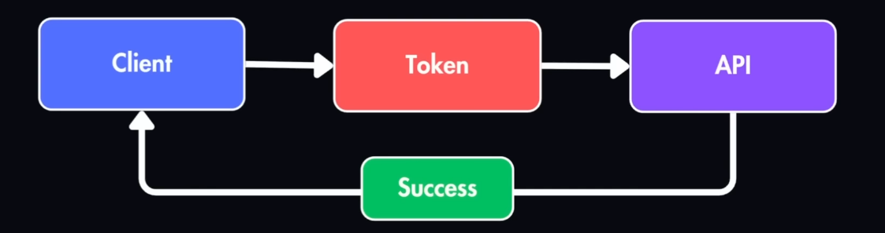
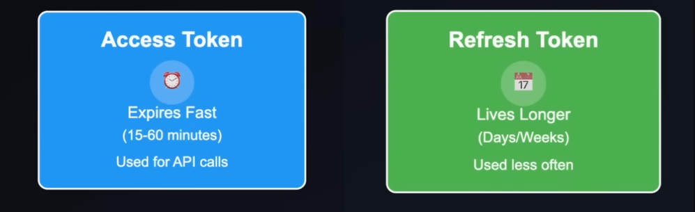
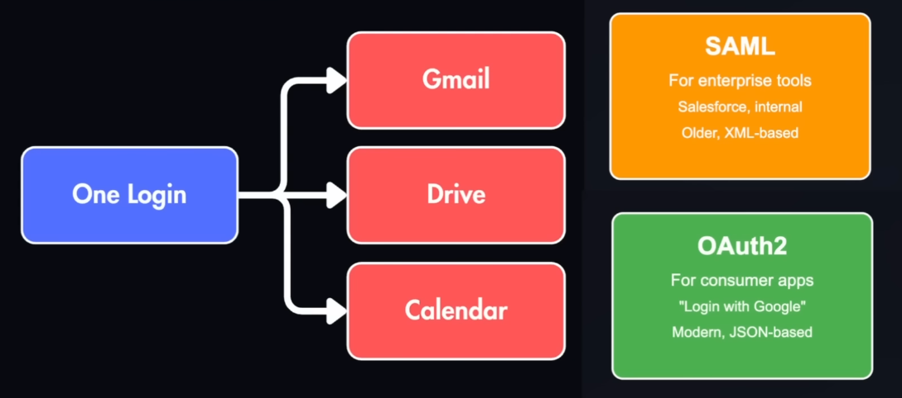

#  Authentication

## When to Use

https://youtu.be/9JPnN1Z_iSY

**Authenticaton**: verifies the person or system trying to access your app is legit

- Basic
- Bearer Tokens
- OAuth2
- JWT
- Access & Refresh
- SSO & Identity Providers


## Basic

Base64(username + password)
- Simple encoding that's easily reversible
- Insecure unless wrapped in HTTPS
- **Rarely used today** outside internal tools


## Bearer Tokens

Bearer<access-token>
- Fast and stateless
- Standard in APIs today



## OAuth2 + JWT

```json
{
    "user_id": "123", 
    "exp": "2026-06-01"
}
```

- Used in logins for Google, Facebook, etc.
- JWTs are stateless -> no need to store sessions 


## Access vs Refresh Tokens

- Store these server-side for security reasons
- When access token expires, use refresh token to generate a new access token
- Users don't have to login again



## SSO & IdPs

- One sign on for multiple providers




## Authorization

- What the user has access to
  
[authorisation](authorisation.md)